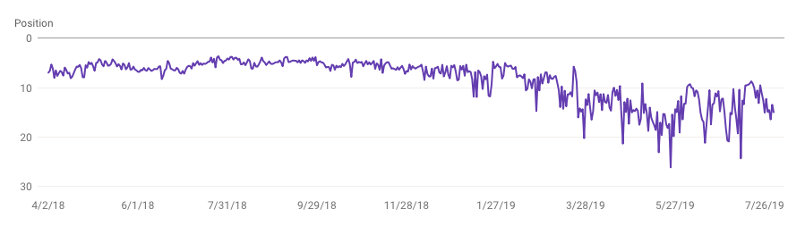

# DisavowTool

A simple tool to create a Disavow file to be uploaded to the [Google Disavow Tool](https://www.google.com/webmasters/tools/disavow-links-main). You'll be able to import the current disavow file, a whitelist with all the trusted URLs and domains and analyse them against new imported URLs you feed DisavowTool with. Auditing and cleaning the back links to your site is essential to have a good SEO.

Tips and donations: Bitcoin SV address **1NN3eRawdJ2dPoKQEnHAY7ug3Q6TwbJ4c3**

## Installation

Simply install the gem:

    $ gem install disavow_tool

You'll have the new command available in your system: `disavow_tool`

## Usage

From the command's help `disavow_tool --help` option:

    Usage: disavow.rb [options] --disavow file_1,file_2,file_3\
                                --import file_1,file_2,file_3\
                                [--whitelist file1,file2,file3]

You simply feed DisavowTool with the current disavow file you have and all the new links you haven't analysed yet. You can feed multiple disavow files and import files. Optionally you can feed DisavowTool with a whitelist so that DisavowTool can do the heavy lifting

DisavowTool will try to remove from the imported URLs all known URLS provided in the Disavow files and the Whitelist files as well as removing all URLs with the same domain as found in Disavow or Whitelist.

Once the cleanup of the imported URLs is done you'll be asked URL by URL what DisavowTool should do:

      Links pending to analysed 241
      **************************************************************
      *
      * Analysing url: https://scammysyte.com/wordpress-comments
      * Website title: Viagra for all
      * URls with this same domain: 180
      *
      ***************************************************************
      [W] Whitelist as domain [w] Whitelist URL [a] whitelist as url All urls with this domain
      [D] Disavow as domain [d] Disavow as URL
      [o] to open the URL [.] to exit

After the analysis is complete, DisavowTool will export a Disavow file ready to me uploaded to the [Google Disavow Tool](https://www.google.com/webmasters/tools/disavow-links-main). DisavowTool will also export a new whitelist, ideally you should feed this whitelist the next time you run your analysis for the same domain.

## Disavow files format
The format will be the same as [defined by Google](https://support.google.com/webmasters/answer/2648487?hl=en)

    # Comments
    # Domains
    domain:scammysite.com
    domain:scammysite2.com
    # URLs
    https://viagraforall.com/wordpress_comments
    https://seo_scammers.com/wordpress_comments10

## Whitelist files format
The format will be the same as [defined by Google](https://support.google.com/webmasters/answer/2648487?hl=en)

    # Comments
    # Domains
    domain:most_popular_site.com
    domain:wow_this_site_linked_back_to_me.com
    # URLs
    https://maybe_a_good_site.com/the_best_product
    https://should_we_trust_this_domain.com/product_review

## Import files format
Each line should contain a complete URL.

    https://newsite.com/path
    https://newsite2.com/path
    https://newsite3.com/path

## FAQ

### Why do I need to keep track of the toxic domains?
Well... Google lies https://www.youtube.com/watch?v=HWJUU-g5U_I

The reality is your site will get killed with a negative SEO attack, period.

Just check one of our sites that received an attack:

Google is slow, your site's SEO won't be affected instantly if you are a victim of this type of attack but you have a colony of termites eating you from the inside. One day, out of nowhere your wood will crack and if your revenue is very SEO dependant you may be very close to bankruptcy if not completely broke. You better integrate a backlink clean up in your SEO routie as soon as possible.

In essence you need to do all the work Goole, in our opinion, should be doing.

### Why not just use _SEMrush back link audit_ or _Ahrefs_?

Good question.

Ahrefs doesn't let you import links other than what their software finds so you are out of luck if you have a better source of new backlinks.

SEMrush is better in that regard as they let you import new back links and connect your account to other services such as Google Search Console or services like Majestic. The bad news is SEMrush crawls the web with **curl** identifying themselves against the new imported backlinks and if they get an HTTP error, they discard the site and you aren't able to put that domain or URL into your disavow file from their website application. The result is malicious sites return HTTP 500 or 403 when they detect bots to detect them. Just as example, this clear malicious or infected site http://carreviewauto.com/statti/kak-uberech-avto-ot-ugona-4-zolotyx-pravila.html​ returns 403 for the SEMSush routine. SEMRush's curl command:

      curl -i -sS -L --proto-redir -all,http,https --max-time 5 -A 'Mozilla/5.0 (compatible; SemrushBot-SA/0.97;+http://www.semrush.com/bot.html)' -H 'Accept-Encoding: gzip, deflate' -H'Accept: */*' --compressed http://carreviewauto.com/statti/kak-uberech-avto-ot-ugona-4-zolotyx-pravila.html​

Response headers:

      HTTP/1.1 403 Forbidden
      Server: nginx
      Date: Sun, 04 Aug 2019 13:23:04 GMT
      Content-Type: text/html; charset=iso-8859-1
      Content-Length: 334
      Connection: keep-alive
      Keep-Alive: timeout=60

SEMRush's customer service has declined to change this.

## Our workflow
1. We keep using SEMRush backlink audit tool as it's a bit more polished. Once a month we run their tool and download the generated disavow file _(disavow_semrush.cvs)_ and whitelist _(whitelist.cvs)_.

2. We also download the current disavow file uploaded to [Google Disavow Tool](https://www.google.com/webmasters/tools/disavow-links-main).

3. We download the most sampled _(GSC_most_sampled.cvs)_ and latest links _(GSC_latest.cvs)_ found by [Google Search Console](https://search.google.com/search-console).

4. We download the new backlinks found by [ahrefs](https://ahrefs.com) _(new_ahrefs.cvs)_

5. We download the new backlinks found by [Majestic](Majestic.com) _(new_majestic.cvs)_

6. We have the whitelist generated by disavow in our last session whitelist_last_disavow_tool_session.csv

7. We run the following command:
        disavow_tool -V --disavow disavow_semrush.cvs,whitelist.cvs\
                        --whitelist.cvs,whitelist_last_disavow_tool_session.csv\
                        --import GSC_most_sampled.cvs,GSC_latest.cvs,new_ahrefs.cvs,new_majestic.cvs

8. Upload the generated disavow file to [Google Disavow Tool](https://www.google.com/webmasters/tools/disavow-links-main) and save the generated whitelist file for the next session.

## Development

After checking out the repo, run `bin/setup` to install dependencies. Then, run `rake spec` to run the tests. You can also run `bin/console` for an interactive prompt that will allow you to experiment

To install this gem onto your local machine, run `bundle exec rake install`. To release a new version, update the version number in `version.rb`, and then run `bundle exec rake release`, which will create a git tag for the version, push git commits and tags, and push the `.gem` file to [rubygems.org](https://rubygems.org).

## Contributing

Bug reports and pull requests are welcome on GitHub at https://github.com/maesitos/disavow_tool.

## License

The gem is available as open source under the terms of the [MIT License](https://opensource.org/licenses/MIT).
